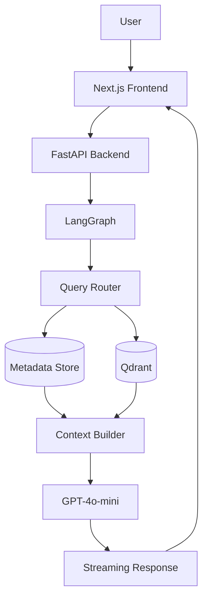

Full-stack AI intelligence system for Creator using FastAPI, LangGraph, Qdrant, and streaming RAG pipelines for comparative video analysis.
# Creator Intelligence RAG

A full-stack creator intelligence platform that transforms video URLs into streaming, cited, and memory-aware conversations.

The system combines transcript understanding, engagement analytics, semantic retrieval, and conversational AI to help creators understand why one video outperformed another and how future content can be improved.

---

# Problem Statement

Traditional creator analytics platforms expose metrics such as:

- Views
- Likes
- Comments
- Engagement rates

However, they do not explain:

- Why one video outperformed another
- Which hooks were most effective
- What storytelling patterns drove engagement
- How creators can improve future content

This project aims to bridge that gap through a hybrid Retrieval-Augmented Generation (RAG) architecture.

---

# Core Features

## Video Ingestion

Supported Platforms:

- YouTube
- Instagram Reels

Capabilities:

- Transcript extraction
- Metadata extraction
- Creator information retrieval
- Engagement rate calculation

---

## Creator Intelligence

The system answers questions such as:

- Why did Video A outperform Video B?
- Compare the hooks in the first five seconds.
- What is the engagement rate of each video?
- Who created Video B?
- Suggest improvements for Video B using insights from Video A.

---

## Hybrid Retrieval

The architecture combines:

### Structured Retrieval

Used for:

- Views
- Likes
- Comments
- Engagement rates
- Creator metadata

### Semantic Retrieval

Used for:

- Hook analysis
- Storytelling analysis
- Transcript reasoning
- Improvement recommendations

---

## Streaming Responses

Responses are streamed in real time using Server-Sent Events (SSE).

Benefits:

- Lower perceived latency
- Better user experience
- Faster feedback

---

## Memory-Aware Conversations

The system maintains conversational context across multiple turns, enabling follow-up questions and deeper creator analysis.

---

# Architecture

## High-Level System Design



---

# Technology Stack

## Frontend

- Next.js
- Tailwind CSS

## Backend

- FastAPI

## AI Orchestration

- LangGraph

## Embeddings

- OpenAI Embeddings

## Vector Database

- Qdrant

## LLM

- GPT-4o-mini

## Video Processing

- yt-dlp
- youtube-transcript-api
- Whisper

---

# Project Structure

```text
creator-intelligence-rag/

├── backend/
├── frontend/
├── docs/
│   ├── architecture/
│   │   ├── problem-definition.md
│   │   ├── system-design.md
│   │   ├── retrieval-flow.md
│   │   └── scaling.md
│   ├── diagrams/
│   └── notes/
│
├── README.md
├── .env.example
└── docker-compose.yml
```

---

# Architecture Documents

Detailed design decisions are documented in:

- docs/architecture/problem-definition.md
- docs/architecture/system-design.md
- docs/architecture/retrieval-flow.md
- docs/architecture/scaling.md

---

# Scalability Considerations

The architecture is designed to support:

- High-volume video ingestion
- Streaming retrieval workflows
- Efficient vector search
- Cost-optimized inference

Future scaling strategies include:

- Redis queues
- Worker-based ingestion
- Transcript caching
- Embedding caching
- Distributed retrieval infrastructure

---

# Development Roadmap

## Phase 1

- [ ] Backend setup
- [ ] YouTube ingestion
- [ ] Instagram ingestion

## Phase 2

- [ ] Chunking
- [ ] Embeddings
- [ ] Qdrant integration

## Phase 3

- [ ] Hybrid retrieval
- [ ] LangGraph workflow
- [ ] Citations

## Phase 4

- [ ] Streaming responses
- [ ] Conversation memory

## Phase 5

- [ ] Frontend implementation
- [ ] End-to-end testing

---

# Current Status

Project architecture and implementation planning complete.

Implementation currently in progress.
