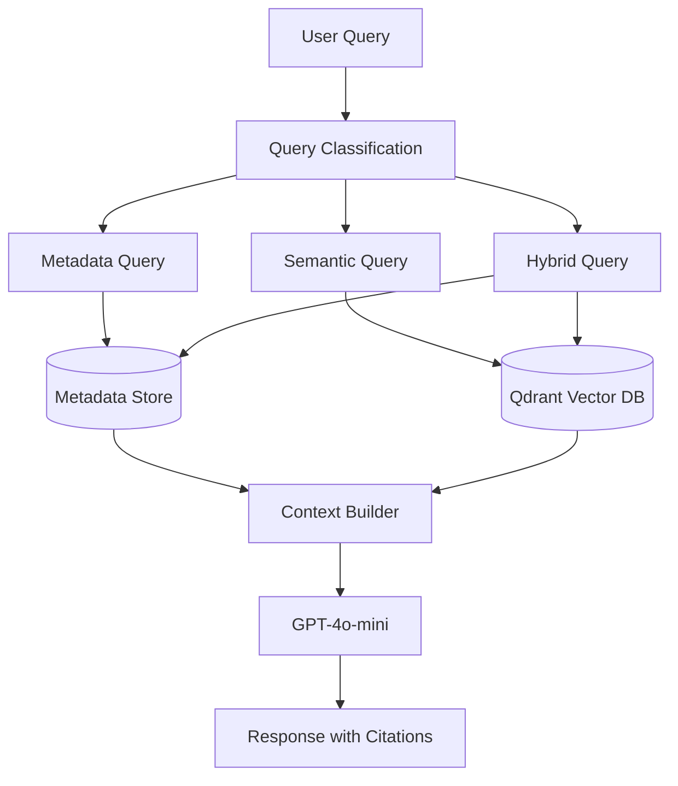
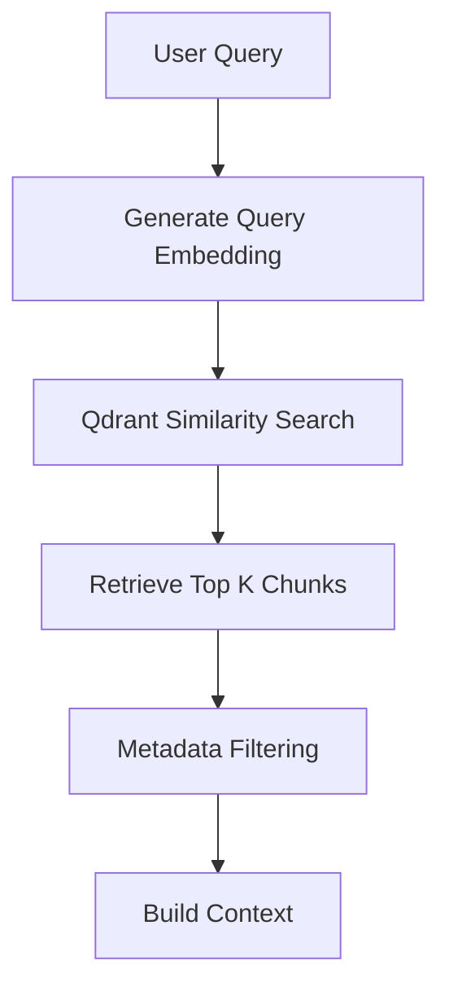
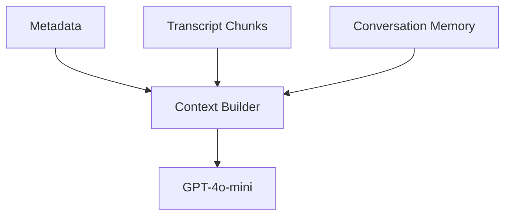

# Retrieval Flow

# Overview

For the Creator Intelligence RAG system We use a Hybrid Retrieval Architecture that combines:

1. Structured Retrieval
2. Semantic Retrieval

This design, we chose because creator-focused questions require both deterministic analytics and contextual transcript understanding.

Using vector search alone would be insufficient for engagement metrics, creator metadata, and exact numerical calculations.

The retrieval system therefore routes queries to the most appropriate retrieval mechanism before constructing context for the language model.

---

# Retrieval Objectives

The retrieval layer is for:

- Retrieving creator metadata
- Retrieving engagement metrics
- Retrieving relevant transcript segments
- Supporting video-to-video comparison
- Grounding responses with citations
- Reducing hallucinations
- Maintaining low latency

---

# High-Level Retrieval Flow



---

# Query Classification

The first step is to identify what type of information the user requires.

The system classifies incoming requests into one of three categories.

---

## Metadata Queries

This is deterministic retrieval.

Examples:

- What is the engagement rate of Video A?
- Who is the creator of Video B?
- How many views did Video A receive?

These questions rely on structured metadata and do not require semantic retrieval.

Data Source:

- Metadata Store

---

## Semantic Queries

This is for transcript understanding.

Examples:

- Compare the hooks in the first five seconds
- What storytelling techniques were used?
- What themes appear in Video A?

These questions rely on semantic similarity search.

Data Source:

- Qdrant Vector Database

---

## Hybrid Queries

This is for both structured analytics and transcript understanding.

Examples:

- Why did Video A outperform Video B?
- Suggest improvements for Video B using what worked in Video A
- Explain the engagement difference between the videos

These questions combine:

- Metadata
- Transcript retrieval

Data Sources:

- Metadata Store
- Qdrant Vector Database

---

# Structured Retrieval Layer

Purpose:

Retrieve exact data efficiently.

Stored Information:

- Creator name
- Views
- Likes
- Comments
- Upload date
- Duration
- Engagement rate

Example:

```json
{
  "video_id": "A",
  "views": 50000,
  "likes": 4500,
  "comments": 380,
  "engagement_rate": 9.76
}
```

Structured retrieval provides:

- Fast lookups
- Deterministic answers
- Accurate calculations

---

# Semantic Retrieval Layer

Purpose:

Retrieve contextually relevant transcript segments.

Stored Information:

- Transcript chunks
- Embeddings
- Timestamps
- Video references

Example:

```json
{
  "video_id": "A",
  "chunk_id": 3,
  "timestamp": "00:10-00:22",
  "text": "..."
}
```

Semantic retrieval is used for:

- Hook analysis
- Storytelling analysis
- Semantic comparison
- Recommendation generation

---

# Transcript Retrieval Process



The retrieved chunks are ranked according to semantic similarity and combined into a context window for generation.

---

# Hook-Aware Retrieval

A major requirement for creator is analyzing the first few seconds of a video.

To support this:

- Early transcript chunks are tagged during ingestion
- Hook-related queries prioritize these chunks
- Hook chunks are surfaced before general transcript chunks

Example Metadata:

```json
{
  "video_id": "A",
  "chunk_id": 1,
  "is_hook": true
}
```


---

# Context Construction

Retrieved information is merged before generation.

The context builder combines:

1. Metadata
2. Transcript Chunks
3. Conversation History



The resulting context is passed to the language model.

---

# Citation Strategy

Every retrieved chunk contains:

- Video ID
- Chunk ID
- Timestamp

Example Citation:

```text
[Video A | Chunk 3 | 00:10-00:22]
```

Benefits:

- Explainability
- Traceability
- User trust

---

# Why Hybrid Retrieval?

Using vector search for everything creates several problems:

- Exact calculations become unreliable
- Numerical accuracy decreases
- Metadata lookups become inefficient

Using structured retrieval for everything creates different problems:

- No semantic understanding
- No transcript reasoning
- No contextual comparison

Hybrid retrieval combines the strengths of both approaches.

Advantages:

- Accurate analytics
- Strong semantic reasoning
- Lower hallucination rates
- Better scalability
- Lower retrieval cost

---

# Design Decision Summary

The retrieval layer is intentionally designed around hybrid retrieval rather than pure vector search.

This architecture enables:

- Accurate creator analytics
- Transcript-based reasoning
- Source-grounded responses
- Efficient scaling
- Cost-effective retrieval

The result is a retrieval system capable of supporting creator-intelligence workflows rather than functioning as a generic chatbot.
