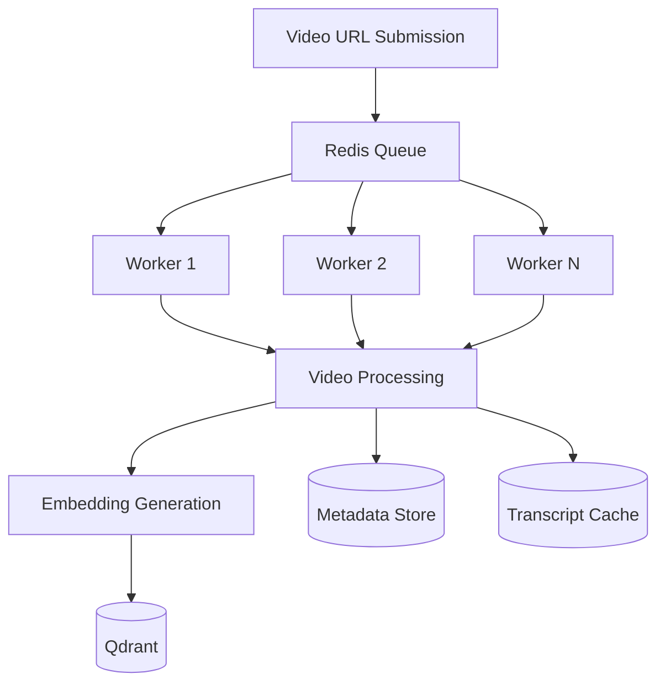
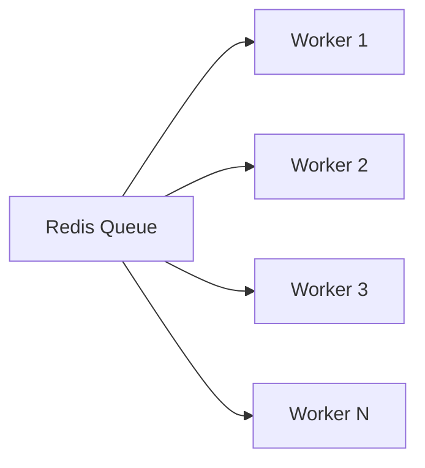

# Scaling Strategy

# Overview

Our goal is not only to provide accurate creator intelligence but also to remain cost-efficient and responsive as usage grows.

The architecture support increasing workloads while maintaining:

- Retrieval quality
- Low latency
- Cost efficiency
- Operational simplicity

By one by one we delve deeper into expected bottlenecks, scaling strategies, and cost optimization decisions.

---

# Scaling Objectives

The system support:

- Thousands of video ingestions
- Thousands of retrieval requests
- Concurrent creator conversations
- Low response latency
- Sustainable infrastructure costs

Target workload:

- 1,000+ creators per day
- Multiple videos per creator
- Multiple conversational queries per session

---

# High-Level Scalable Architecture

---

# Why Async Processing?

A synchronous architecture performs poorly when handling:

- Long videos
- Multiple uploads
- Audio transcription workloads

Tasks as:

- transcript extraction
- Whisper transcription
- chunking
- embedding generation

take several seconds or minutes.

Running them synchronously increase latency and reduce system throughput.

Instead, ingestion workloads will be processed asynchronously.

---

# Primary Bottlenecks

The largest scaling challenges are:

## 1. Audio Transcription

Transcription is typically the most expensive and time-consuming stage.

Challenges:

- CPU/GPU intensive
- High latency
- Repeated processing of identical videos

Mitigation:

- Cache completed transcripts
- Avoid duplicate processing
- Process asynchronously

---

## 2. LLM Inference

LLM calls become the largest recurring operational cost.

Challenges:

- Token costs
- Response latency
- Concurrent users

Mitigation:

- Retrieval before generation
- Smaller production models
- Prompt optimization
- Context compression

---

## 3. Platform Rate Limits

External platforms limit:

- Metadata extraction
- Media downloads

Challenges:

- Request throttling
- Temporary failures

Mitigation:

- Retry logic
- Queue-based processing
- Cached video data

---

## 4. Embedding Throughput

Large-scale ingestion generates significant embedding workloads.

Challenges:

- High request volume
- Processing latency

Mitigation:

- Batch embedding generation
- Cache embeddings
- Avoid duplicate processing

---

# Caching Strategy

Caching is one of the most important cost optimization techniques.

---

## Transcript Cache

Stores:

- Extracted transcripts
- Platform metadata

Benefits:

- Prevents repeated downloads
- Reduces transcription costs

---

## Embedding Cache

Stores:

- Previously generated embeddings

Benefits:

- Eliminates duplicate embedding requests
- Faster ingestion

---

## Metadata Cache

Stores:

- Views
- Likes
- Comments
- Creator information

Benefits:

- Reduces repeated external API calls

---

# Ingestion Scaling Strategy

As ingestion volume increases, additional workers will be added.

Benefits:

- Parallel processing
- Increased throughput
- Fault isolation

This is for ingestion capacity to grow independently from user-facing services.

---

# Retrieval Scaling Strategy

The retrieval layer scales differently from ingestion.

The majority of retrieval requests are:

- Vector similarity search
- Metadata lookups

Qdrant is well-suited for:

- Fast nearest-neighbor search
- Metadata filtering
- Large-scale vector storage

Retrieval operations are typically cheaper than generation operations.

---

# Cost Optimization Strategy

The largest misconception in RAG systems is assuming embeddings dominate costs.

In practice:

## Major Cost Drivers

1. LLM Inference
2. Audio Transcription

Embeddings are generally inexpensive compared to repeated generation.

---

## Cost Optimization Decisions

### GPT-4o-mini

Selected because:

- Lower inference cost
- Lower latency
- Strong retrieval-augmented performance

---

### text-embedding-3-small

Selected because:

- Low embedding cost
- Good retrieval quality
- Suitable for transcript workloads

---

### Hybrid Retrieval

Benefits:

- Reduces unnecessary context
- Improves retrieval precision
- Reduces token consumption

---

### Caching

Benefits:

- Lower operational cost
- Reduced latency
- Improved user experience

---

# What Breaks First at 10,000 Users?

The most likely bottlenecks are:

1. Transcription throughput
2. Queue processing delays
3. Platform rate limits
4. LLM inference cost

The vector database is unlikely to become the first bottleneck.

This is because retrieval operations are significantly cheaper than generation and transcription workloads.

---

# Future Scaling Improvements

Potential future enhancements include:

- Distributed worker pools
- Managed Qdrant deployment
- Background ingestion pipelines
- Batch processing
- Smarter transcript compression
- Retrieval re-ranking
- Multi-level caching

These improvements can be introduced incrementally as demand increases.

---

# Design Philosophy

We prioritize:

- Simplicity
- Reliability
- Cost efficiency
- Incremental scalability

Rather than optimizing prematurely for enterprise-scale workloads, focus is on supporting creator workflows efficiently while providing clear upgrade paths as usage grows.

