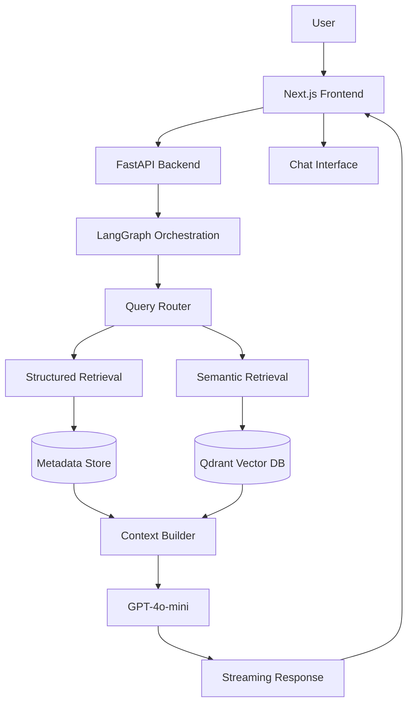
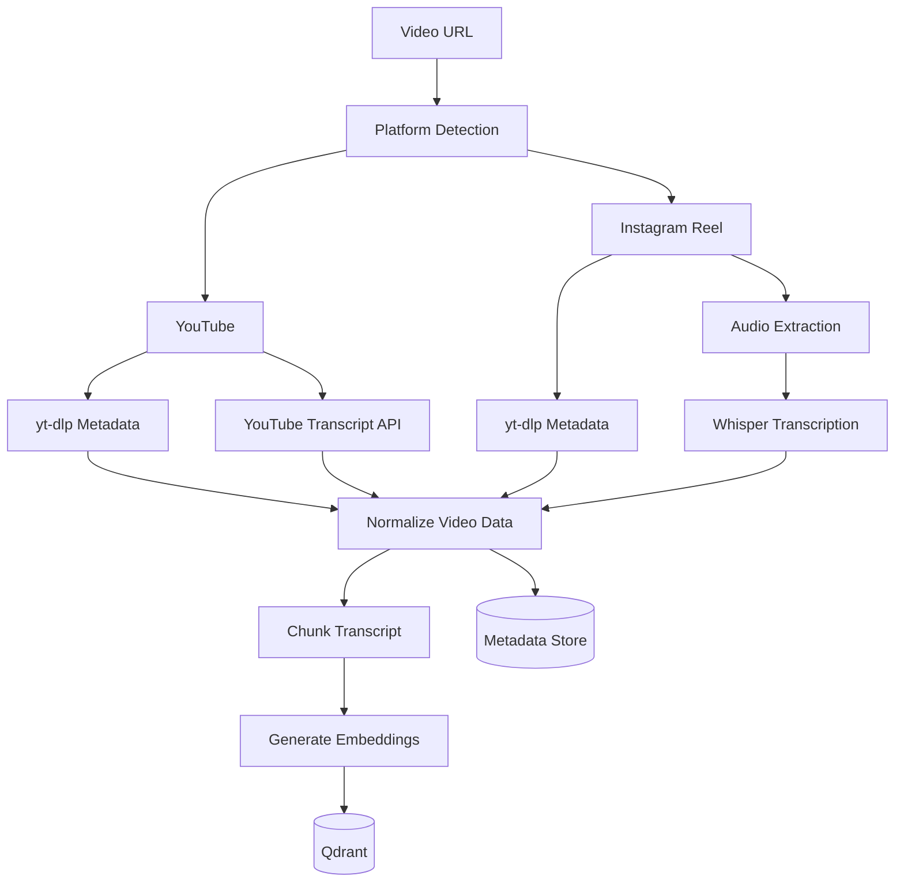
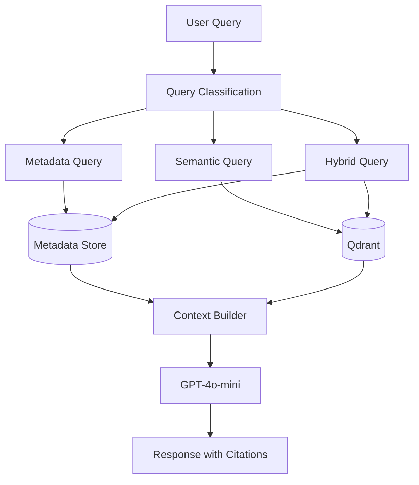
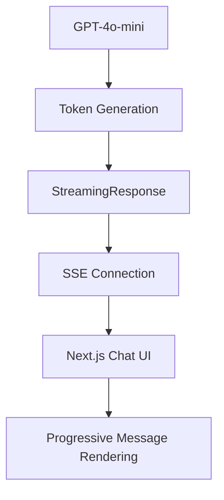
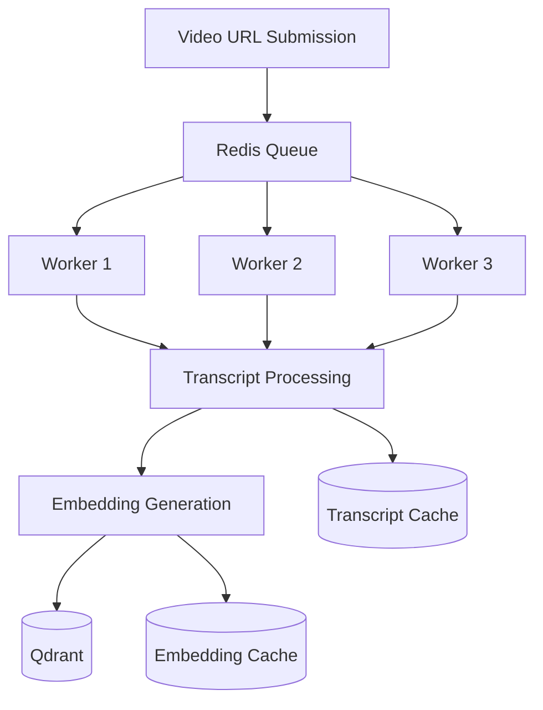

# System Design

# Overview

The Creator Intelligence RAG system transform raw video URLs into grounded, memory-aware, and source-cited conversations that help creators understand content performance.

The architecture is:

- Multi-platform video ingestion
- Structured analytics retrieval
- Semantic transcript retrieval
- Conversational reasoning
- Streaming response generation

The system prioritize:

- Retrieval quality
- Low latency
- Cost efficiency
- Scalability
- Explainability

---

# High-Level Architecture



---

# Major Components

## Frontend Layer

Tech stack:

- Next.js
- Tailwind CSS

For:

- Video URL submission
- Video comparison interface
- Streaming chat experience
- Citation rendering
- Conversation history

The frontend intentionally is lightweight and delegates all process to the backend.

---

## Backend Layer

Tech Stack:

- FastAPI

For:

- API routing
- Ingestion orchestration
- Retrieval orchestration
- Streaming responses
- LangGraph execution

FastAPI has strong Python AI ecosystem compatibility and native asynchronous support.

---

## LangGraph Orchestration Layer

Tech stack:

- LangGraph

For:

- Query processing
- Retrieval orchestration
- Memory management
- Context construction

The graph workflow has clear execution paths and future extensibility without introducing unnecessary agent complexity.

---

# Storage Architecture

The system separates structured retrieval from semantic retrieval.

---

## Structured Metadata Store

Stores:

- Video title
- Creator
- Upload date
- Likes
- Comments
- Views
- Engagement rate
- Duration

Example:

```json
{
  "video_id": "A",
  "creator": "Creator Name",
  "views": 50000,
  "likes": 4200,
  "comments": 380,
  "engagement_rate": 9.16
}
```

Structured retrieval is for deterministic analytics and exact metadata lookups.

---

## Vector Database

Tech stack:

- Qdrant

Stores:

- Transcript chunks
- Embeddings
- Chunk metadata
- Timestamps
- Video references

Example:

```json
{
  "video_id": "A",
  "chunk_id": 4,
  "timestamp": "00:12-00:24",
  "text": "..."
}
```

Semantic retrieval is for:

- Hook comparison
- Storytelling analysis
- Content reasoning
- Improvement suggestions

---

# Ingestion Pipeline

The ingestion layer processes both YouTube and Instagram content.



---

# Transcript Processing

Transcript data is transformed into semantic chunks.

Chunking strategy:

- Chunk Size: 800 characters
- Overlap: 120 characters

Goals:

- Preserve semantic context
- Improve retrieval quality
- Minimize context fragmentation

Additional metadata is attached to every chunk.

---

# Retrieval Architecture

The system uses a Hybrid Retrieval Architecture.



Examples:

Metadata Query:

- "What is the engagement rate of Video A?"

Semantic Query:

- "Compare the hooks in the first five seconds."

Hybrid Query:

- "Why did Video A outperform Video B?"

---

# Memory Management

The system maintains conversational context using LangGraph state.

For:

- Multi-turn conversations
- Follow-up questions
- Context continuity

Example:

User:
"Compare the hooks."

Follow-up:
"What improvement would you suggest?"

The system maintains awareness of previously discussed videos.

---

# Streaming Architecture

Streaming is implemented using Server-Sent Events (SSE).

Benefits:

- Lower perceived latency
- Improved user experience
- Faster feedback loops



---

# Cost Optimization Strategy

Primary cost drivers:

1. LLM inference
2. Audio transcription

Embeddings are comparatively inexpensive.

Optimization techniques:

- Transcript caching
- Embedding caching
- Metadata caching
- Lightweight embedding model
- GPT-4o-mini response generation

---

# Scalability Strategy

For large-scale creator ingestion workloads, the architecture evolve into:



We expect bottlenecks when scale:

- Transcription latency
- Platform rate limits
- Inference costs
- Queue throughput

we will use worker-based ingestion, batching, and caching.

---

# Design Decisions

## Why FastAPI?

- Strong AI ecosystem
- Async support
- Lightweight architecture

## Why LangGraph?

- Explicit workflow control
- State management
- Future extensibility

## Why Qdrant?

- Fast semantic retrieval
- Metadata filtering
- Easy local deployment

## Why Hybrid Retrieval?

- Structured analytics require deterministic retrieval
- Transcript reasoning requires semantic retrieval
- Combining both improves accuracy and scalability

The architecture is intentionally designed as a production-oriented creator intelligence system rather than a generic chatbot wrapper.
